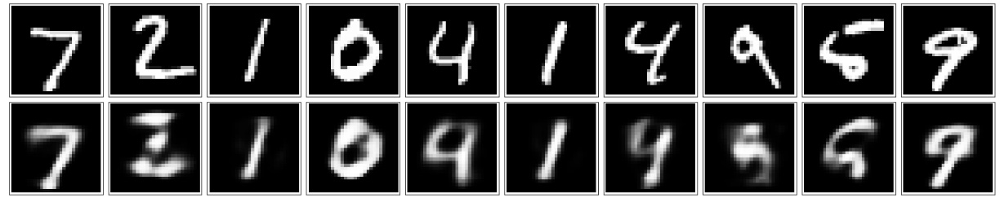

# A simple encoder-decoder 

The code in encoder-decoder.py is a simple encoder to compress the MNIST dataset. 

With encoders, I pass input data through an encoder that makes a compressed representation of the input. 

Then, this representation is passed through a decoder to reconstruct the input data. 

**Here are some images reconstructed from the encoder outputs:**

