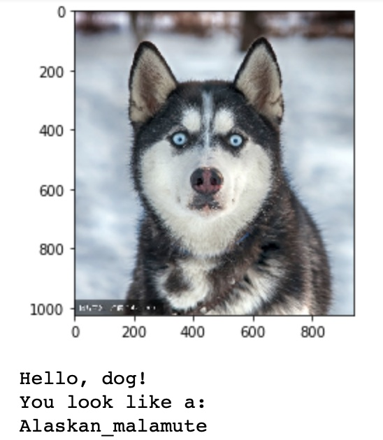
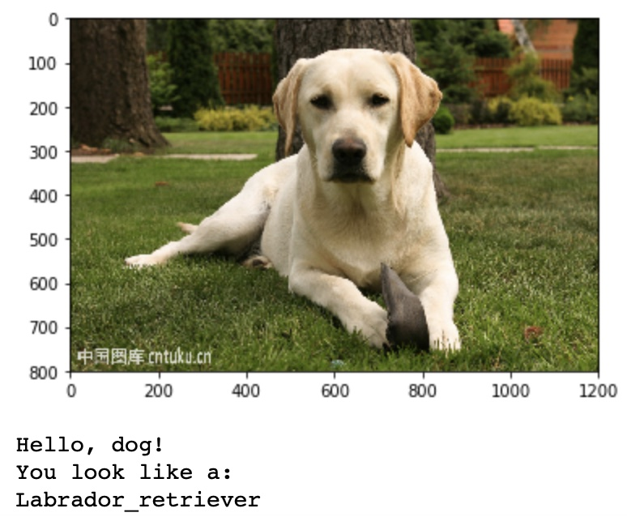
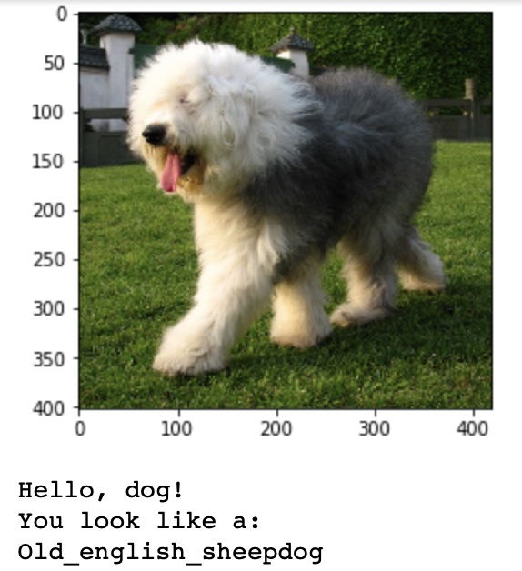

# Classify different dogs with CNN

**In this project, the task is**
- Determine the object in an input image, a dog or a human.
- If the object is a dog, tell the breed of that dog. 

**In the dog_classification.py, there are 2 different implementations for this task.**
-   A CNN trained only for this task.
-   A CNN made up of a pre-trained Resnet to extract bottleneck features and a simple classfication network to finish the task.

**Some final outputs are as below:**

