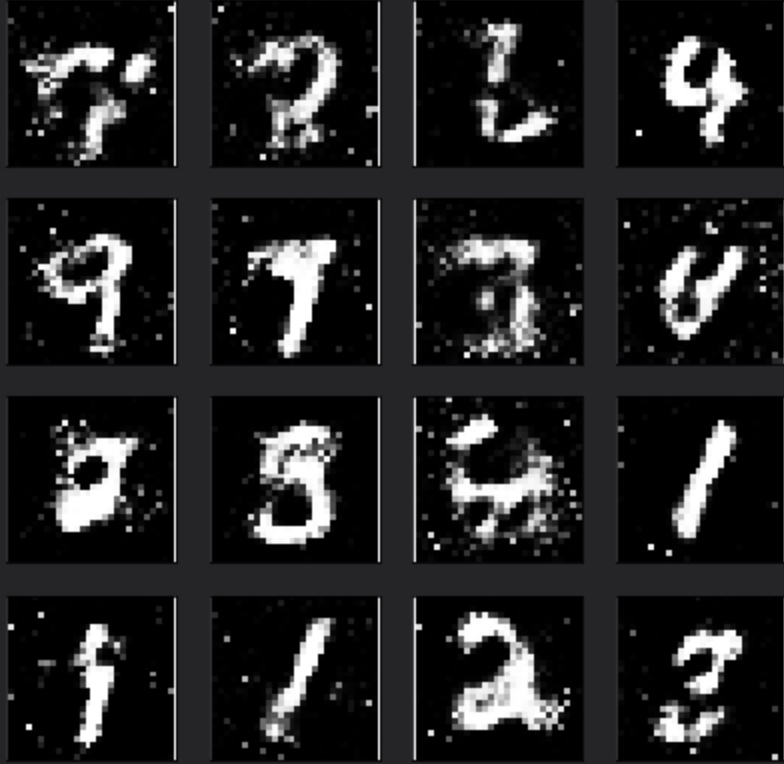

# Use GAN to generate hand-written digits

*This foler contains the code and data of using GAN as a generative model to generate hand-written digits.*

**The network architecture of this GAN is quite simple:**

- The generator consists of 2 fully-connected layers with Leaky ReLU and tanh as activation functions.
- The discriminator also consists of 2 fully-connected layers while the activation functions are Leaky ReLU and sigmoid.

**Training details:**
- In this task, I used 55000 images of hand-written digits from the MNIST data set as the training set. 

- After 100 epochs, the model could generate recognizable hand-written digts from the input of random noise z.

**The final results are as follows:**

