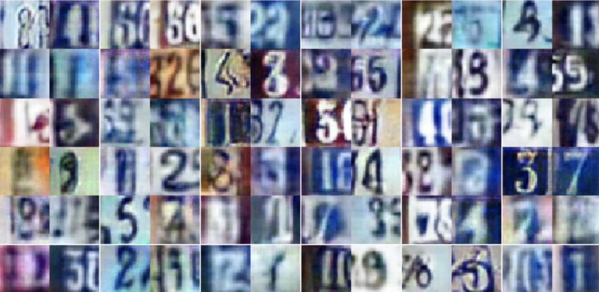

# Deep Convolutional GANs

**In this project, a GAN using convolutional layers in both generator and discrinator( DC-GAN ) is build to generate images of house numbers.**

The DC-GAN model is trained on SVHN( Street View House Numbers ) dataset.

Some images generated by the final model are as follows:

